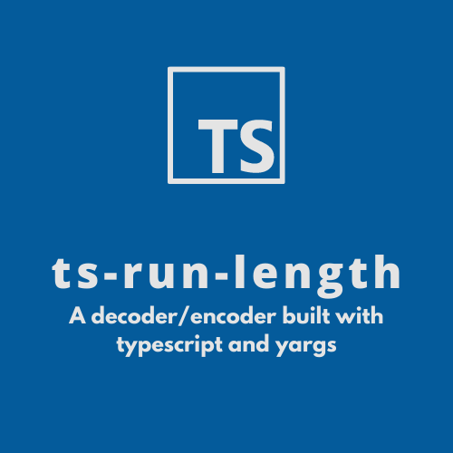

<!-- PROJECT LOGO -->
<br />
<p align="center">
  <a href="https://gitlab.com/nhulox97/ts-run-length">
    
  </a>

  <h3 align="center">ts-run-length</h3>

  <p align="center">
    A decoder/encoder built with typescript and yargs
  </p>
</p>

<!-- TABLE OF CONTENTS -->
<details open="open">
  <summary>Table of Contents</summary>
  <ol>
    <li>
      <a href="#about-the-project">About The Project</a>
      <ul>
        <li><a href="#built-with">Built With</a></li>
      </ul>
    </li>
    <li>
      <a href="#getting-started">Getting Started</a>
      <ul>
        <li><a href="#prerequisites">Prerequisites</a></li>
        <li><a href="#installation">Installation</a></li>
      </ul>
    </li>
    <li><a href="#usage">Usage</a></li>
    <li><a href="#contributing">Contributing</a></li>
    <li><a href="#license">License</a></li>
    <li><a href="#contact">Contact</a></li>
  </ol>
</details>

<!-- ABOUT THE PROJECT -->

## About the project

[comment]: <> (TODO: Add project description)

### Built With

This section should list any major frameworks that you built your project using. Leave any add-ons/plugins for the acknowledgements section. Here are a few examples.

- [node](https://nodejs.org/es/)
- [eslint](https://www.npmjs.com/package/eslint)
- [ts-node](https://www.npmjs.com/package/ts-node)
- [nodemon](https://www.npmjs.com/package/nodemon)
- [rimraf](https://www.npmjs.com/package/rimraf)
- [yargs](https://www.npmjs.com/package/yargs)
- [typescript-eslint](https://www.npmjs.com/package/typescript-eslint)
- [typescript](https://www.typescriptlang.org/)
- [prettier](https://prettier.io/)

<!-- GETTING STARTED -->

## Getting Started

This is an example of how you may give instructions on setting up your project locally.
To get a local copy up and running follow these simple example steps.

### Prerequisites

You must need to have installed some tools before use this template, I will give you a list of them
next:

- npm
  ```sh
  npm install npm@latest -g
  ```
- [nodejs](https://nodejs.org/en/download/package-manager/)

### Installation

1. Clone the repo
   ```sh
   git clone https://gitlab.com/nhulox97/ts-run-length.git
   ```
2. Install NPM packages
   ```sh
   npm i
   ```

<!-- USAGE EXAMPLES -->

## Usage

### package.json commands

This project have a list of differents commands that you can execute, I'll describe all of them next:

- `npm run start -> Internally will exec 'build' command and also execute ./build/main.js`

- `npm run start:dev -> Executes ./src/main.ts in hot-reload mode thanks by nodemon`
- `npm run build -> Compile every single file into ./src dir from .ts to .js`
- `npm run lint -> Executes the linter (ESlint) in all project files. `
- `npm run format -> Executes the formatter (prettier) in all project files, also it overwrite the files which were formatted.`

[comment]: <> (DONE: Add script usage and examples)

### main script (arguments and options)

```sh
 ts-node src/main.ts -h
run-length [input-file] ...[options]

Options:
  -e, --encode   Encode the given file                                  [string]
  -d, --decode   Decode the given file, if it is correctly encoded      [string]
  -h, --help     Show help                                             [boolean]
  -v, --version  Show version number                                   [boolean]

Examples:
  run-length [input-file] -e  Encode the file if it format is supported
  run-length [input-file] -d  Decode the file if it format is supported

@nhulox97 node-trainee-program 2021
-------------------------------------------------------------------------------
[-e | -d] 'At least on of both flags must be included'
```

### main script examples

You will be able to execute the main script in three differents ways:

1. By executing the build script which gonna compile the entire `/src` folder into `/build` folder.
   Then you will execute from cli the next command:

```sh
  ./build/main.js [input-file] ...[options]
```

2. By running `npm run start`, you just need to pass the required argumenst after `--` chars:

```sh
  npm run start -- [input-file] ...[options]
```

3. By running `npm run start:dev`, you just need to pass the required argumenst after `--` chars,
   the difference with the previous command is the hot-reload feature that provides `nodemon` module:

```sh
  npm run start:dev -- [input-file] ...[options]
```

<!-- CONTRIBUTING -->

## Contributing

Contributions are what make the open source community such an amazing place to be learn, inspire,
and create. Any contributions you make are **greatly appreciated**.

1. Fork the Project
2. Create your Feature Branch (`git checkout -b feature/AmazingFeature`)
3. Commit your Changes (`git commit -m 'Add some AmazingFeature'`)
4. Push to the Branch (`git push origin feature/AmazingFeature`)
5. Open a Pull Request

<!-- LICENSE -->

## License

Distributed under the MIT License. See `LICENSE` for more information.

<!-- CONTACT -->

## Contact

Sergio Bernal - [@nhulo97](https://twitter.com/nhulox97) - sergiobernal909@gmail.com

Project Link: [https://github.com/nhulox97/ts-base-setup](https://gitlab.com/nhulox97/ts-run-length)
